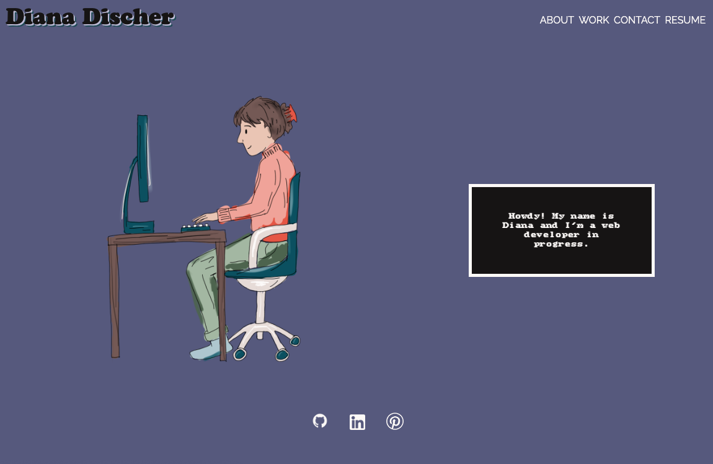

# Portfolio

## Description

This is a portfolio page! And very much a work in progress.

It starts with a responsive header and navbar. The navbar links to an about section, a work section, a contact section, and a PDF of my resume. The navbar could be styled better but that's for another day! In mobile, the title shrinks to my initials and the navigation becomes a hamburger icon, that up clicking drops the nav links from the top of the screen.

The main content begins with a full screen hero that's responsive. The hero includes an illustration, a scripted typewriter textbox, and external links to work-relevant pages (ish. Pinterest is debatable but I don't have a lot of professional links yet). Hero doesn't have much going on, but as I've said it's very much still in progress.

The about section is a responsive flex design that becomes a column in mobile.

The work section has a larger box for my first dev project, as instructed. When you hover over any of the boxes, it shows you links to the deployed page and the GitHub repo.

The contact form is a work in progress but has input fields for a name, email, and message. Ideally when you click "send email" an email would send to my email address, but for now it opens the user's default mail application.

And the footer says I made the site!

## Screenshot of Webpage

Link: https://dianamariedischer.github.io/portfolio/

## Usage

This page is for employers to learn more about me, get a sense of my skillset, view my projects and resume, and contact me.

## Credits

The hamburger menu and typewriter functions in the script were copied from W3.

Menu: https://www.w3schools.com/howto/howto_js_mobile_navbar.asp

Typewriter: https://www.w3schools.com/howto/howto_js_typewriter.asp

Credit to @jade in the theme.co forum for some lines of code that hopefully make my type less chunky and more legible in Safari.

https://theme.co/forum/t/font-weights-and-letter-spacing-way-off-on-ios-safari-and-chrome/70670/5

## License

Please refer to the LICENSE in the repo.

